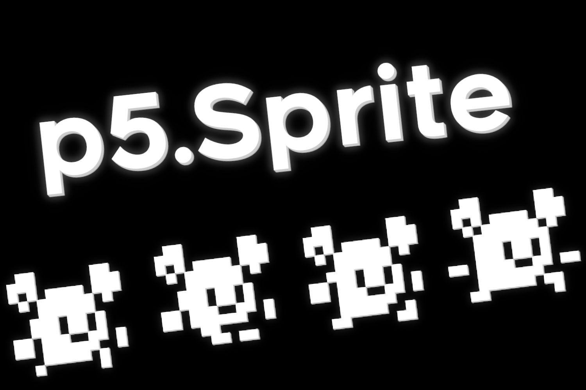

# p5.Sprite
A basic sprite library that supports both animated and static sprites for p5.js

Create a new instance with `constructor(atlas, sprites, pos, size, speed)`. `atlas` is simply the texture, `sprites` the sprites in the format of a list containing more lists of format [x, y, w, h] (this is the part of the atlas that will be drawn), `pos` the position in a list of format [x, y],  `size` the size in a format of [x, y], and speed being how fast the sprite changes from one to another in the animation. Remember when animation that the progress is normalized from 0-1 when choosing your speed.

To draw the sprite simply call `sprite.tick(useDeltatime)` with `useDeltatime` being a boolean that's `true` when you want to use `deltaTime` and `false` when you don't.

This library requires you to import [AnimatorJs](https://github.com/RandomGamingDev/AnimatorJs/tree/main). To import this library you can either manually import it by adding the `animator.js` file to your own website or import it via the cdn: https://cdn.jsdelivr.net/gh/RandomGamingDev/p5.Sprite/sprite.js.
